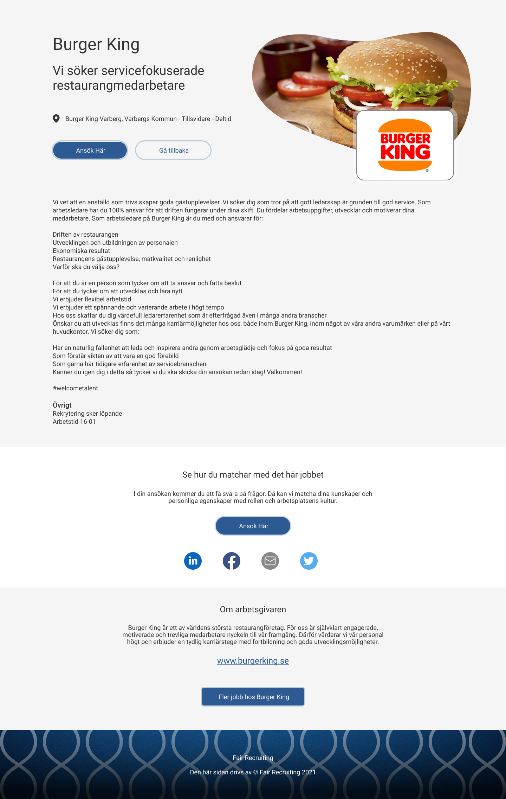
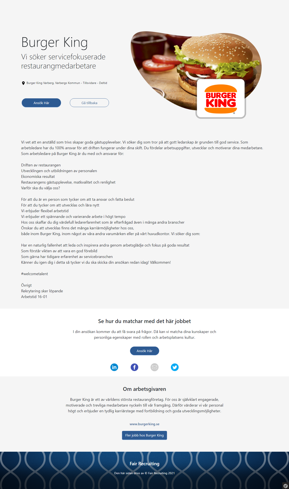

<h1 align="center">Happyr Figma integration test</h1>

    

 
I would like you to use Bootstrap 5 + your custom SCSS and implement a “job advert page” like this: 

I am looking for how you structure the HTML and Sass as well as the final result. 
 

### Figma capture

### Code capture

